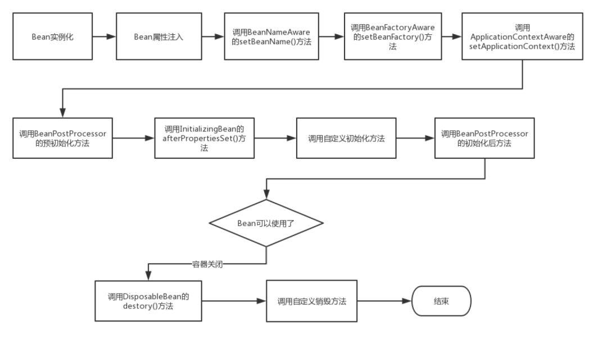

## Spring学习笔记

### IoC和AOP

IoC（Inversion of Control）意为控制反转。

首先了解一下不反转的情况。通常我们实例化一个对象时，都是使用类的构造方法来new一个对象，这个过程由我们自己控制。而控制反转就是把new一个对象的工作交给Spring容器来做，让Spring来管理一个Bean的生命周期。

实现IoC有两个方式：

+ 依赖查找

  容器提供一个回调接口和上下文环境，这样一来，组件就必须自己使用容器提供的API来查找资源。是一种更为主动的方式。

+ 依赖注入

  组件不自己做资源查询，容器全权负责组件的装配工作，把符合依赖关系的对象通过setter方法或构造方法传递给需要的对象。应用程序被动接收对象。

IoC的优点：

+ 降低了组件之间的耦合，实现软件各层之间的解耦；
+ 可以使用容器提供的众多服务，如事务管理、消息服务等；
+ 容易利用AOP技术实现权限拦截、运行监控等功能；
+ 方便集成各种优秀的框架。


AOP（Aspect Oriented Programming）意为面向切面编程。它是一种在运行时，动态地将代码织入到类指定的方法、指定位置上的编程思想。比如业务A和业务B需要一个相同的操作，传统方法我们需要在A和B中都加入相关操作代码，而应用AOP可以只写一遍代码，A、B共用这段代码。在不改动原有代码的情况下，灵活添加新的业务逻辑实现。

Spring中AOP基于Java的动态代理实现。

AOP一般应用于**参数校验、日志记录、事务控制、权限控制、性能统计、异常处理**。

AOP优点：

+ 在不改变原有代码的情况下，增强了原有的业务逻辑；
+ 实现了代码的复用，简化了开发和维护；
+ 各个不同步骤之间的良好隔离性，业务步骤只需要专注实现业务，其他的校验等功能通过AOP实现，实现了职责分离。

### Spring中的容器

`BeanFactory`是一个顶级的接口，声明了一系列`getBean`方法。

`ApplicationContext`是`BeanFactory`的子接口，做了一些扩展。

Spring容器就是某个实现了`ApplicationContext`的类的实例。从代码层面看，也就是说，Spring容器就是一个`ApplicationContext`实例。

Spring容器的基本功能是Bean的组织管理（Bean实例化、配置Bean等）。

### Spring解决循环依赖

Spring的单例对象初始化主要分三步：

1. Bean实例化，即调用构造方法实例化对象；
2. 填充属性，主要是对Bean的依赖属性进行填充；
3. 调用指定的init方法。

循环依赖主要发生在第1、2步。通过构造方法注入的循环依赖Spring无法解决，直接抛出异常。

通过注解和setter方法注入解决循环依赖的理论依据是Java的引用传递。Java对象对另一个对象的引用是通过地址来实现的，而被引用的对象是否完成初始化不影响对其地址的引用。

Spring为了解决单例的循环依赖问题，使用了三级缓存，分别是：

+ 单例对象的cache
+ 单例对象工厂的cache
+ 提前曝光的单例对象cache

A首先完成初始化第一步，并将自己提前暴露在第三级缓存，然后发现自己依赖了B，于是去get(B)，发现B还没初始化，所以走B初始化流程。B在初始化时发现依赖了A，于是从第一级缓存查找，发现没找到，一直找到第三级缓存，发现了一个已实例化但未完成属性设置的A实例，顺利完成初始化。B完成初始化后将自己放入第一级缓存，此时A可以从第一级缓存中拿到B，完成初始化。

### Spring Bean作用域

1. singleton（单例模式）

   Spring容器中只会存在一个共用的Bean实例，无论多少个Bean引用它，都指向同一个对象。

   该模式在多线程下是不安全的。

   Singleton作用域是Spring中的缺省作用域。

2. prototype（原型模式）

   每次通过Spring容器获取prototype定义的Bean时，容器都将创建一个新的Bean实例，每个Bean实例都有自己的属性和状态。

   对有状态的Bean使用prototype作用域，而对无状态的Bean使用singleton作用域。

3. request（每一次请求都新建一个实例）

   每一次Http请求，容器都会返回同一个实例，而对不同的请求，则会创建新的Bean实例。该Bean实例仅在当前Http Request内有效，当Http请求结束，Bean实例也被销毁。

   该作用域仅适用于Spring的`WebApplicationContext`容器中。

4. session

   同一个Http Session共享同一个Bean实例，而对不同的Session会创建不同的Bean实例。同request作用域一样，Session结束，Bean实例将被销毁。

   该作用域仅适用于Spring的`WebApplicationContext`容器中。

5. application

   限定一个Bean的作用域为`ServletContext`的生命周期。

   该作用域仅适用于Spring的`WebApplicationContext`容器中。

### Spring Bean生命周期



1. Bean实例化；

2. Bean属性注入；

3. 调用一系列的aware接口中声明的方法；

   1）`BeanNameAware`的`setBeanName()`方法设置Bean的名字；

   2）`BeanFactoryAware`的`setBeanFactory()`设置Bean工厂；

   3）`ApplicationContextAware`的`setApplicationContext()`方法设置容器引用；

4. 调用`BeanPostProcessor`的`postProcessBeforeInitialization()`前处理方法；

5. 调用`InitializingBean`的`afterPropertiesSet()`方法，做一些Bean属性设置完成后的一些处理；

6. 调用自定义初始化方法；

7. 调用`BeanPostProcessor`的`postProcessAfterInitialization()`后处理方法；

8. 此时，Bean可以使用了；

9. 容器关闭，调用`DisposableBean`的`destroy()`方法，释放占有的资源；

10. 调用自定义的销毁方法；

11. 结束。

### Spring依赖注入的方式

1. 基于注解注入

2. 构造器注入

3. setter方法注入

4. 静态工厂注入

   静态工厂即是不需要实例化的工厂，直接调用静态工厂的静态方法即可获得对象。

5. 实例工厂注入

   而实例工厂需要实例化，通过实例化的工厂对象获得Bean。

### 四种不同的自动装配方式

1. no

   默认的方式，通过ref指定。

2. byName

   通过属性名自动装配，Spring会在容器中查找名称与Bean属性同名的Bean，并注入到Bean里。

3. byType

   通过属性的类型，在容器中找到该类型的Bean注入。如果容器中含有多个这个类型的Bean，将会抛出异常。

4. constructor

   通过构造器的参数类型，在容器中找到该类型的Bean，在构造方法中设置属性。

5. autodetect

   通过反射机制来决定是使用`constructor`还是`byType`来装配。如果发现有默认构造器，则通过构造器的方式来装配。

`@Autowired`注解：

`@Autowired`注解是通过`byType`方式来查找和装配属性的。

默认情况下，`@Autowired`注解意味着依赖是必须的，如果在容器中没有找到对应类型的Bean，将会抛出异常。可通过`@Autowired(required=false)`选项关闭默认行为。

如果有多个同类型的Bean实例，可通过`@Qualifier("beanName")`注解来指定一个Bean实例。

### 事务隔离级别

Spring中事务隔离级别比数据库事务的隔离级别多了一个`DEFAULT`。

+ DEFAULT：使用数据库的默认隔离级别，MySQL中是REPEATABLE_READ。
+ READ_UNCOMMITTED
+ READ_COMMITTED
+ REPEATABLE_READ
+ SERIALIZABLE

### 事务传播行为

+ PROPAGATION_REQUIRED

  Spring默认的事务传播行为。如果有外层事务，则将当前事务加入到外层事务；如果没有外层事务则新建一个事务执行。

+ PROPAGATION_REQUES_NEW

  如果有外层事务，则将外层事务挂起，新建一个事务执行；如果没有外层事务，直接新建一个事务执行。

+ PROPAGATION_SUPPORT

  如果有外层事务，则加入外层事务执行；否则以无事务的方式执行。

+ PROPAGATION_NOT_SUPPORT

  该传播行为不支持事务，如果存在外层事务，则将外层事务挂起，执行当前代码后将外层事务恢复。

+ PROPAGATION_NEVER

  该传播行为不支持事务，如果存在外层事务将抛出异常。

+ PROPAGATION_MANDATORY

  该传播行为强制要求事务，如果不存在外层事务，则抛出异常。

+ PROPAGATION_NESTED

  如果存在外层事务，将新建一个事务嵌入到外层事务，相当于新建一个保存点。

## SpringMVC

### 什么是MVC？

MVC是模型（Model）、视图（View）、控制器（Controller）的简写，是一种软件设计规范。

是按业务逻辑、数据、显示分离的方法来组织代码。

MVC的主要作用是**降低视图与业务逻辑间的双向耦合**。

MVC不是一种设计模式，**MVC是一种架构模式**。

+ 模型：数据模型，提供要展示的数据，因此**包含数据和行为**；
+ 视图：负责模型的展示，一般就是我们见到的用户界面。
+ 控制器：接受用户请求，委托给模型进行处理（状态改变），处理完毕后把返回的模型数据传给视图，由视图负责展示。

### Spring MVC

Spring的web框架围绕`DispatcherServlet`设计。`DispatcherServlet`的作用是将请求分发到不同处理器。Spring MVC和其他许多MVC框架一样，**以请求为驱动，围绕一个中心Servlet分派请求以及提供其他功能。`DispatcherServlet`是一个Servlet，它继承自`HttpServlet`**。

Spring MVC 的请求处理流程：


Spring MVC 的Context继承体系：


### 接收请求参数

1. 方法的参数与前端传递的参数同名，可以直接使用；

   ```java
   @GetMapping('/test1')
   public String test1(Integer id, String name) {
       return "{id: " + id + ",name: " + name + "}";
   }
   ```

2. 方法的参数与前端传递的参数不同名，加上`@RequestParam`注解将前端传递的参数与方法参数绑定；

   ```java
   @GetMapping('/test2')
   public String test2(@RequestParam("id") Integer myId, 
                       @RequestParam("name") String myName) {
       return "{id: " + myId + ",name: " + myName + "}";
   }
   ```

3. 假设传递的是一个对象，就会匹配对象的字段名，匹配上了就赋值，匹配不上就为null；

   ```java
   @GetMapping('/test3')
   public String test2(User user) {
       return "{id: " + user.getId() + ",name: " + user.getName + "}";
   }
   
   Class User {
       private Integer id;
       private String name;
       
       // 省略getter、setter
   }
   ```

4. 使用`@RequestBody`注解获取JSON参数。

   ```java
   @PostMapping('/test4', produces = "application/json;charset=UTF-8")
   public String test2(@RequestBody User user) {
       return "{id: " + user.getId() + ",name: " + user.getName + "}";
   }
   ```

### 参数校验

在写接口的时候，经常要校验参数，常用的做法是使用大量的`if-else`代码块来做判断。但是这样写使代码看起来乱糟糟的，大大降低可读性。这时可以使用`@Valid`注解来简化校验逻辑。

注解`@Valid`的主要作用是用于数据校验，可以在定义的实体类的属性上添加不同的注解来完成不同的校验规则，而在Controller类上添加`@valid`注解来开启校验功能。需要注意的是，`@Valid`对Get请求的平面参数无效。

```java
public class User {
    @NotBlank(message = "姓名不能为空")
    private String name;
    
    @NotBlank(message = "姓名不能为空")
    @Max(value = 18, message = "不能超过18岁")
    @Min(value = 0, message = "年龄小于0岁")
    private Integer age;
}

@RestController
public class TestController {
    @PostMapping("/user")
    public String addUserInfo(@Valid @RequestBody User user) {
        return "成功";
    }
}
```

`@Valid`校验不合格会抛出`MethodArgumentNotValidException`异常。写一个全局异常处理类：

```java
@RestControllerAdvice("com.example.pojo")   //指定异常处理的包名
public class GlobalExceptionHandler {

    @ResponseStatus(HttpStatus.BAD_REQUEST) //设置状态码为 400
    @ExceptionHandler({MethodArgumentNotValidException.class})
    public String paramExceptionHandler(MethodArgumentNotValidException e) {
        BindingResult exceptions = e.getBindingResult();
        // 判断异常中是否有错误信息，如果存在就使用异常中的消息，否则使用默认消息
        if (exceptions.hasErrors()) {
            List<ObjectError> errors = exceptions.getAllErrors();
            if (!errors.isEmpty()) {
                // 这里列出了全部错误参数，按正常逻辑，只需要第一条错误即可
                FieldError fieldError = (FieldError) errors.get(0);
                return fieldError.getDefaultMessage();
            }
        }
        return "请求参数错误";
    }

}
```

`@Validated`注解也是实现相同的功能，两者的区别：

|        | `@valid`                                 | `@validated`                                       |
| ------ | ---------------------------------------- | -------------------------------------------------- |
| 分组   | 不支持                                   | 支持                                               |
| Target | 可用在方法、构造器、方法参数和成员属性上 | 可用在类型、方法和方法参数上，但不能用在成员属性上 |


### Spring MVC 拦截器

Spring MVC的处理拦截器类似于Servlet开发中的过滤器Filter，用于对处理器进行预处理和后处理。开发者可以自定义一些拦截器来实现特定的功能。

#### 自定义拦截器

想要自定义拦截器，必须实现`HandlerInterceptor`接口。

这个接口有三个方法：

```java
// 调用Controller里的方法之前
// 返回true表明可以继续后续的处理
default boolean preHandle(HttpServletRequest request, HttpServletResponse response, Object handler) throws Exception {
	return true;
}

// 调用Controller里的方法之后
default void postHandle(HttpServletRequest request, HttpServletResponse response, Object handler, @Nullable ModelAndView modelAndView) throws Exception {
}

// 整个请求完成之后
default void afterCompletion(HttpServletRequest request, HttpServletResponse response, Object handler, @Nullable Exception ex) throws Exception {
}
```

然后配置：

```java
@Configuration
@EnableWebMvc
public class WebConfig implements WebMvcConfigurer {

    @Override
    public void addInterceptors(InterceptorRegistry registry) {
        registry.addInterceptor(new LocaleChangeInterceptor());
        registry.addInterceptor(new ThemeChangeInterceptor()).addPathPatterns("/**").excludePathPatterns("/admin/**");
        registry.addInterceptor(new SecurityInterceptor()).addPathPatterns("/secure/*");
    }
}
```

